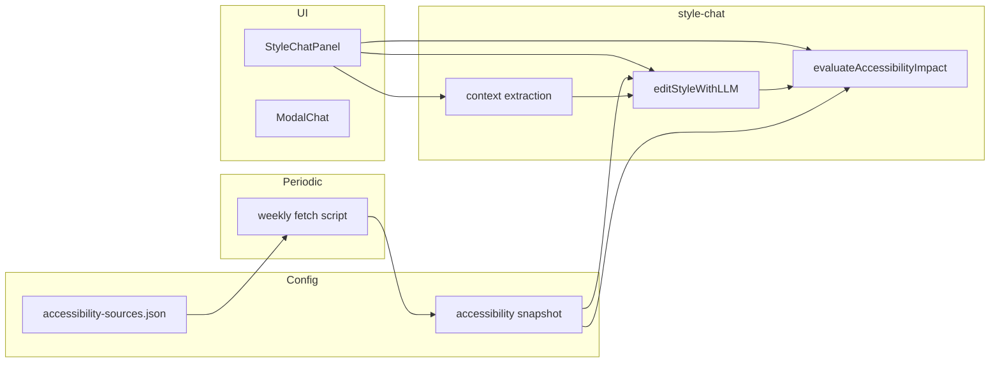

# Accessibility-guided style chat

## Goals

- **Sources:** Agent uses *only* a configurable list of standards/sources (seed with W3C WAI); user will add more later.
- **Evaluation:** After each style change, evaluate accessibility impact (negative / positive / minor); warn and suggest alternatives when negative; cite only configured sources; use your exact disclaimer when impact is minor.
- **Context:** From the first 1–3 prompts, infer “what the map is about”, “needs of its users”, "why the map is being made", "what problems it may be solving", "what questions it may be answering"; send that context with every subsequent style prompt.

## Architecture

- **Single source of truth for “sources”:** One config file (and later optional UI) that lists source URLs. A **periodic script** (e.g. weekly) fetches those URLs and writes a **snapshot** (full text or summaries). At runtime the agent uses **only the snapshot**—no per-session fetch—so token use is predictable and sources are strictly respected.
- **Edit flow unchanged at API level:** Keep one “patch-only” call for edits. After a successful patch, run a **second** LLM call for accessibility evaluation so parsing stays simple and evaluation uses only the snapshot content.
- **Context:** Stored in chat session state; first 1–3 exchanges can trigger extraction; that context is appended to every later edit (and evaluation) request.

---

## 1. Configurable accessibility sources and snapshot (no per-session fetch)

**Add:** `[src/config/accessibility-sources.json](src/config/accessibility-sources.json)` (new)

- Array of `{ "id": string, "url": string, "title": string }`.
- Seed with W3C WAI standards overview and key subpages (e.g. [W3C WAI Standards Overview](https://www.w3.org/WAI/standards-guidelines/), optionally [How to Meet WCAG (Quick Reference)](https://www.w3.org/WAI/WCAG21/quickref/)).
- This file is the **list of URLs** to fetch; it is not sent to the model on every session.

**Periodic fetch script (e.g. weekly):** Add a script (e.g. `scripts/refresh-accessibility-snapshot.js`) that: (1) reads `accessibility-sources.json`, (2) fetches each URL, (3) extracts main text from the page (strip HTML / readability-style), (4) writes a **snapshot** to e.g. `src/config/accessibility-snapshot.json` or `public/accessibility-snapshot.json` as an array of `{ id, url, title, content }`. Run on a schedule (e.g. cron weekly) or when sources change. No fetch at chat session start—only the pre-built snapshot is used.

**Runtime:** Load the **snapshot** and pass it into the accessibility evaluation prompt; instruct the model: base your evaluation and citations only on these snapshots; do not cite or rely on other standards. Token use is bounded by snapshot size. If the snapshot is too large: truncate per-source `content` in the script, or store summaries; the weekly script enforces limits.

No other code paths should introduce arbitrary accessibility “knowledge”; the evaluation step is the only place that talks about accessibility, and it receives only this list.

## 2. Accessibility evaluation after each style change

**Add:** New function in `[src/libs/style-chat.ts](src/libs/style-chat.ts)`, e.g. `evaluateAccessibilityImpact(params)`.

- **Inputs:**  
  - Summary of the patch (or before/after style diff), e.g. “layer X: text-size 12→10, font-weight 600→400”.  
  - The **accessibility snapshot** (pre-fetched by the weekly script: array of `{ id, url, title, content }`).  
  - Optional **map context** string (purpose, user needs) if available.
- **Output:** One of:
  - **Negative:** Short explanation, citation to one or more of the configured sources (by title/URL), and 1–2 concrete **suggestions** for more accessible alternatives (e.g. avoid thinner fonts / reduced letter-spacing for readability/dyslexia).
  - **Positive:** Short note that the change improves accessibility, with citation where relevant.
  - **Minor / neutral:** Use this **exact** wording (or very close):  
  “I didn’t find any significant benefit or downside in accessibility from these style changes but I can get things wrong. I’m not perfect but my goal is to raise the bar on what to expect in terms of accessibility, not to reach where it actually should be on my own. We’ll never get to where things ought to be, and can be, without sustained human attention to the problem.”

**Integration:**

- In `[src/libs/style-chat.ts](src/libs/style-chat.ts)`, after a successful patch in `editStyleWithLLM`, call `evaluateAccessibilityImpact` (or call it from `[StyleChatPanel.tsx](src/components/StyleChatPanel.tsx)` after `editStyleWithLLM` returns success). Append the evaluation string to the existing `explanation` (patch summary + any prose) before returning to the UI. So the user sees: “[existing summary] … [accessibility note].”
- Evaluation uses the **same** API (and proxy) as the edit call but with a **different system/user message**: no style JSON, only “evaluate this list of changes against these sources only; output one of the three forms above.”

**Prompt design:**

- System prompt must state: “Use only the following sources. Do not cite or rely on any other standards or guidelines.” Then list the configured URLs (and titles). If you later add fetched content, inject it here.
- Pass the patch summary (and optional map context) in the user message. Ask for a short, structured reply: negative (warn + cite + suggest), positive (note + cite), or neutral (disclaimer above).

---

## 3. First 1–3 prompts: map purpose and user needs

**Goal:** In the first 1–3 user messages, the agent should infer “what the map is about”, “needs of its users”, "why the map is being made", "what problems it may be solving", "what questions it may be answering". That information must be sent with **every subsequent** style prompt (and with the accessibility evaluation) so edits and evaluations are context-aware.

**Options:**

- **A) Separate “context extraction” call:** After each of the first 1–3 user messages (and optionally after the edit response), call the API with a short prompt: “From this conversation, extract: (1) what this map is for, (2) who the users are and what they need. One short paragraph total.” Store the result in chat state and pass it into every later `editStyleWithLLM` and `evaluateAccessibilityImpact` call.
- **B) Relax patch-only response for first N turns:** For message index < 3, allow the model to return prose after the patch (e.g. “CONTEXT_JSON: { … }”) and parse it. This would require changing the current “only return a JSON Patch array” contract and parser for the first few turns.

**Recommendation:** Option A. Keeps the edit call strictly “patch only”; context is explicit and easy to store/pass.

**Implementation:**

- In `[StyleChatPanel.tsx](src/components/StyleChatPanel.tsx)` (or a small helper used by it), maintain `mapContext: string | null` in state. When `messages.length` (or number of user sends) is 1, 2, or 3, after the normal edit flow run a lightweight **context extraction** request (same API/proxy, different prompt); set `mapContext` from the response and do not overwrite on later turns (or merge/refine if you want).
- Extend `[EditStyleParams](src/libs/style-chat.ts)` (and the payload built in `editStyleWithLLM`) to accept an optional `mapContext?: string`. When present, prepend or append it to the user message (or system) so the model can tailor the patch. Pass the same `mapContext` into `evaluateAccessibilityImpact`.

---

## 4. Data flow and wiring

- **Load snapshot:** On app or chat open, load the **accessibility snapshot** (pre-built by the weekly script from `accessibility-sources.json`), e.g. from `src/config/accessibility-snapshot.json` or `public/accessibility-snapshot.json`. Pass it into the chat flow; do not fetch sources at session start.
- **StyleChatPanel state:** Add `mapContext: string | null`. After a successful edit for one of the first 1–3 user messages, call the context-extraction endpoint and set `mapContext`. For every edit (including the first 1–3), pass `mapContext` into `editStyleWithLLM` and into the evaluation step.
- **EditStyleParams:** Add optional `mapContext?: string` and `accessibilitySnapshot?: Array<{ id: string; url: string; title: string; content: string }>` (the pre-fetched snapshot). `editStyleWithLLM` uses `mapContext` in the edit prompt; after a successful patch it (or the caller) calls `evaluateAccessibilityImpact(patchSummary, accessibilitySnapshot, mapContext)` and appends the result to `explanation`.
- **Evaluation and proxy:** Reuse the same `apiUrl` / `apiKey` and proxy as the edit call; only the request body (system + user messages) changes for the evaluation and context-extraction calls.

---

## 5. Files to add or change (summary)

| Area                                                                             | Action                                                                                                                                                                                                                                                                     |
| -------------------------------------------------------------------------------- | -------------------------------------------------------------------------------------------------------------------------------------------------------------------------------------------------------------------------------------------------------------------------- |
| `[src/config/accessibility-sources.json](src/config/accessibility-sources.json)` | **Add.** Seed with W3C WAI standards overview URL(s). List of URLs for the fetch script only.                                                                                                                                                                              |
| `scripts/refresh-accessibility-snapshot.js` (or similar)                         | **Add.** Weekly (or on-demand) script: read sources config, fetch each URL, extract text, write `accessibility-snapshot.json`. Enforce token-size limits (truncate or summarize per source) in the script.                                                                 |
| `src/config/accessibility-snapshot.json` or `public/accessibility-snapshot.json` | **Add (generated).** Output of the script. App loads this at runtime; evaluation prompt uses only this content.                                                                                                                                                            |
| `[src/libs/style-chat.ts](src/libs/style-chat.ts)`                               | **Extend.** Add `evaluateAccessibilityImpact`; extend `EditStyleParams` with `mapContext`, `accessibilitySnapshot`; after successful patch, call evaluation and append to `explanation`. Optionally add `extractMapContext(conversationHistory)` for the first 1–3 turns.  |
| `[src/components/StyleChatPanel.tsx](src/components/StyleChatPanel.tsx)`         | **Extend.** Load or receive accessibility snapshot; add `mapContext` state; for first 1–3 user sends, call context extraction and set `mapContext`; pass `mapContext` and snapshot into `editStyleWithLLM` and ensure evaluation result is shown in the assistant message. |
| `[src/components/modals/ModalChat.tsx](src/components/modals/ModalChat.tsx)`     | **Optional.** Pass accessibility snapshot into `StyleChatPanel` if loaded at App/Modal level.                                                                                                                                                                              |
| App / config loading                                                             | **Wire.** Load the accessibility snapshot (generated by the weekly script) once and pass to the chat; do not fetch sources at runtime.                                                                                                                                     |

---

## 6. Out of scope for this plan

- **UI to edit the sources list:** You can add a Settings section later to add/remove/edit entries; for now, editing the JSON file (or a `public/` version) is enough.
- **Fetching source content server-side:** Can be a follow-up (e.g. proxy endpoint that fetches each URL and returns text so the evaluation prompt is strictly grounded). Plan only requires passing URLs + strict “use only these” instruction initially.
- **i18n for new strings:** Any new UI strings (e.g. “Accessibility”, “Sources”) can be added to the locales in a later pass; not required for the first version.

---

## 7. Order of implementation

1. Add `accessibility-sources.json` and the **weekly fetch script** that produces `accessibility-snapshot.json`; load the snapshot where the chat is used.
2. Implement `evaluateAccessibilityImpact` in `style-chat.ts` (prompt with “only these sources”, three output forms, exact disclaimer for neutral).
3. In `editStyleWithLLM` (or caller), after successful patch, call evaluation and append to `explanation`; extend params with `mapContext` and `accessibilitySources`.
4. Add `mapContext` state and context-extraction call for first 1–3 prompts in `StyleChatPanel`; pass `mapContext` and sources into every edit and evaluation.
5. Manually test: edit that worsens label readability (e.g. thinner font) → expect warning + citation + suggestion; edit that improves contrast → positive note; edit with minor impact → disclaimer.

